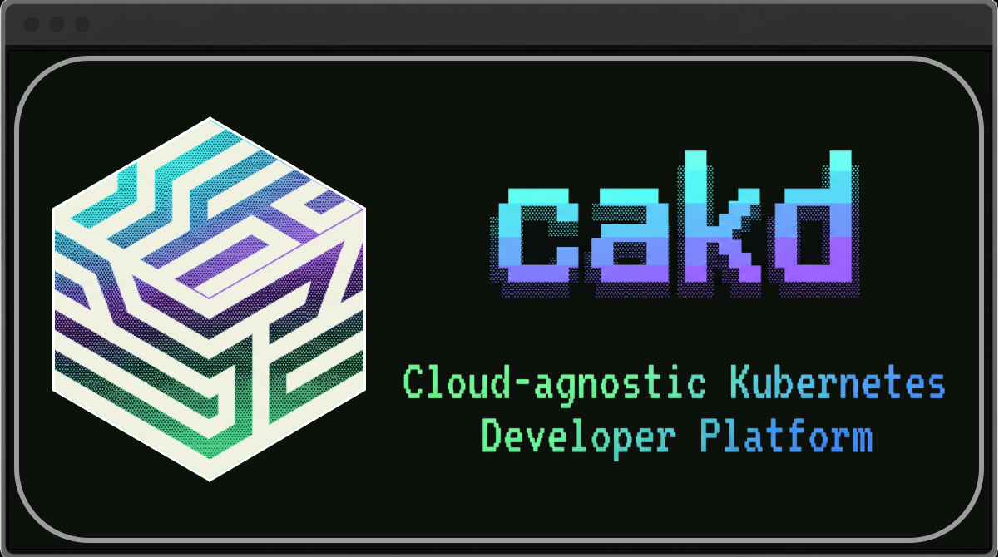

# Cloud-Agnostic Kubernetes Developer Platform

A developer-centric CLI and in-cluster observability agent that scaffolds, deploys, and diagnoses cloud-native
applications — driven by a single declarative YAML configuration file.

---

<div align="center">
  
</div>

---

> **TL;DR:** CAKD eliminates the cognitive load and boilerplate of bootstrapping cloud-native microservices. Define your
> services, backing databases, and observability preferences in a YAML configuration file. CAKD generates standard
> Go/Java
> Spring Boot scaffolds, Dockerfiles, Helm charts, CI/CD pipelines, provisions infrastructure via Terraform, registers
> application targets with ArgoCD, and implements an AI-powered diagnostic agent (cakd-agent) that troubleshoots your
> workloads live.

## Core Capabilities

- **Declarative Architecture** — Define your entire stack (services, databases, alerts, integrations) in a single YAML
  configuration file.
- **GitOps-Ready** — Generates ArgoCD Application manifests and GitHub Actions workflows automatically.
- **Microservices Scaffolding** — Supports production-ready Java Spring Boot templates (Gradle/Maven) with built-in
  database support.
- **Terraform Bridge** — Provisions GitHub repositories, sets up branch protection, and handles CI/CD secrets natively.
- **In-Cluster Agent (cakd-agent)** — Runs inside your cluster, registers with Alertmanager, gathers logs and metrics
  directly, and alerts your team via Discord embed webhooks.
- **AI-Powered Diagnostics** — Connects to Prometheus and Loki, analyzes system metrics/logs, and calls Google Gemini
  for root-cause troubleshooting.

---

## Supported Providers

CAKD adopts an integration-centric model. Below are the provider types and their currently supported integrations in the
codebase:

| Provider Type              | Supported Integrations | YAML Key       | Description                                                          |
|:---------------------------|:-----------------------|:---------------|:---------------------------------------------------------------------|
| **Version Control**        | github                 | versionControl | Repository creation, credentials injection, and settings management  |
| **Continuous Integration** | github-actions         | ci             | YAML workflow generation for compilation, testing, and Docker builds |
| **Continuous Deployment**  | argocd                 | cd             | Declarative GitOps deployment tracking and syncing                   |
| **Notification Channel**   | discord                | notification   | Live alert dispatching with embeds for root-cause analysis           |
| **AI / LLM**               | gemini                 | llm            | AI diagnostic chatbot engine                                         |
| **Metrics Monitoring**     | prometheus             | monitoring     | Gathers workload resource usage and restart metrics                  |
| **Log Aggregation**        | loki                   | logging        | Collects recent runtime application output for error tracing         |

---

## Project Components

The codebase compiles into two distinct binaries:

1. **`cakd`** (CLI): The command-line developer interface for bootstrapping clusters, validating configurations,
   scaffolding projects, and diagnosing issues manually.
2. **`cakd-agent`** (Daemon): The in-cluster notification and monitoring agent that handles real-time alert dispatching
   and Gemini AI analysis.

---

## Documentation

A comprehensive Astro Starlight-powered documentation site is available in the `docs/` folder:

- **Tutorials**: Quickstart instructions for local setup using Minikube.
- **How-to Guides**: Step-to-step guides (e.g., setting up Discord notification channels).
- **Explanation**: Architectural deep dives, design choices, and design patterns.
- **Reference**: Full CLI commands reference and configuration specifications.
- **ADRs**: Architecture Decision Records detailing critical design updates.

To build the documentation site locally:

```bash
cd docs
npm install
npm run build
```

---

## Quick Start

### Prerequisites

- **Go 1.24+**
- **Terraform**
- **Kubernetes Cluster** (e.g. Minikube)

### 1. Installation

#### Build from Source

```bash
git clone https://github.com/nguyentin05/cakd-platform.git
cd cakd-platform
task build
```

The compiled binaries will be output to the `bin/` directory.

---

### 2. Configure Credentials

Instead of exporting plain-text tokens and keys into your terminal history, use the built-in interactive authentication
manager to securely store your credentials:

```bash
# Log in to GitHub (Personal Access Token)
./bin/cakd auth login github

# Log in to Google Gemini (API Key)
./bin/cakd auth login gemini

# Log in to Discord (Bot Token and Guild ID)
./bin/cakd auth login discord
```

To verify the status of your credentials at any time:

```bash
./bin/cakd auth status
```

---

### 3. Declare Your Platform Configuration

Create a configuration YAML file (e.g., `platform.yaml`) in the root of your workspace:

```yaml
apiVersion: platform.dev/v1alpha1
kind: Project
metadata:
  name: test-project
  owner: your-github-username

providers:
  versionControl: github
  ci: github-actions
  cd: argocd
  notification: discord
  llm: gemini
  monitoring: prometheus
  logging: loki

observability:
  alerting: true
  ai:
    model: gemini-flash-latest

services:
  - name: api
    language: java-spring-boot
    languageVersion: "21"
    projectBuild: gradle-project
    packaging: jar
    springConfigFormat: properties
    dependencies:
      - web
```

---

### 4. CLI Usage

#### Validate Your Configuration

Check your configuration schema and dependency trees:

```bash
./bin/cakd validate -f platform.yaml
```

#### Bootstrap Your Cluster

Initialize your Kubernetes cluster (installs ArgoCD, Prometheus Stack, Grafana Loki, and deploys the `cakd-agent`
daemon):

```bash
./bin/cakd init
```

#### Provision and Scaffold

Generate the boilerplate code, build files, Helm charts, provision git repositories via Terraform, and configure ArgoCD
deployment pipelines:

```bash
./bin/cakd create -f platform.yaml
```

#### Troubleshoot Workloads with AI

Manually trigger real-time AI diagnosis on any project namespace:

```bash
./bin/cakd observe test-project
```

---

## Development & Automation

This project uses `Taskfile` as its task runner:

```bash
task fmt       # Format Go source code
task lint      # Run golangci-lint
task test      # Run all unit and integration tests
task build     # Compile both cakd and cakd-agent binaries
task ci        # Run formatting, lint, testing, building, and security scans
```

---

## Contributing

Contributions are welcome. Please read [CONTRIBUTING.md](CONTRIBUTING.md) before submitting a pull request.
This project follows the [Conventional Commits](https://www.conventionalcommits.org/) specification. All commits must
follow the format `type: description`.

## License

Licensed under the [Apache License 2.0](LICENSE).