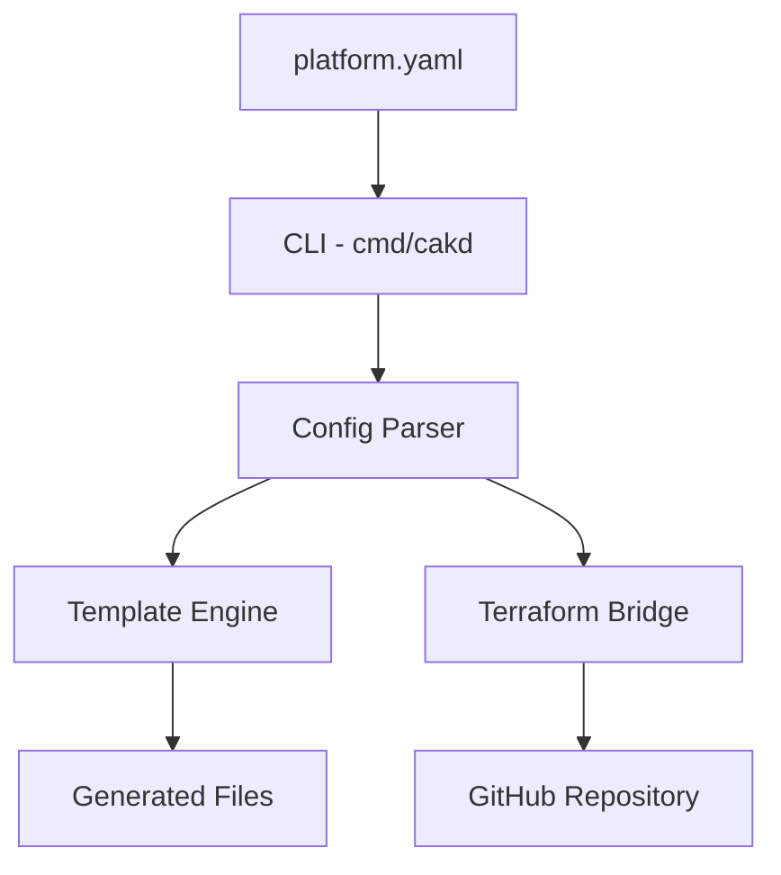

## ROLE
You are a software architect documenting the internals of CAKD Platform for contributors and advanced users.

## TASK
Write an architecture explanation page for Astro Starlight based on the provided Go source code.

## OUTPUT FORMAT

---
title: Internal Architecture
description: How CAKD Platform works internally — components, layers, and execution flow.
---

## Overview

{2-3 sentences. What CAKD Platform is, what problem it solves, what the high-level approach is.}

## Architecture Layers

{Describe each layer from bottom to top. For each layer:}

### {Layer Name}

**Responsibility:** {one sentence}

**Components:** {list the Go packages in this layer}

{2-3 sentences explaining what happens in this layer.}

## Execution Flow

The following describes what happens when `cakd create -f platform.yaml` is run:

1. **{Step name}** — {what happens, which package handles it}
2. ...

## Component Diagram

{Update this diagram to reflect actual components from the source code.}

## Key Design Decisions

- **{Decision}**: {why this approach was chosen, based on what's visible in the code}

## PRESERVATION RULES
1. Return the COMPLETE document
2. If EXISTING DOCUMENTATION is provided: only update sections where the source code shows actual architectural changes (new packages, renamed components, changed flow)
3. The mermaid diagram must reflect actual package names from the source code
4. Never describe components that don't exist in the provided source files
