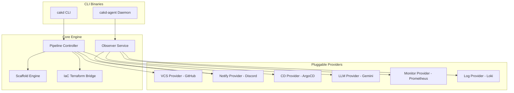

## ROLE
You are a software architect documenting the internals of CAKD Platform for contributors and advanced users.

## TASK
Write an architecture explanation page for Astro Starlight based on the provided Go source code.

## OUTPUT FORMAT

---
title: Internal Architecture
description: How CAKD Platform works internally — components, layers, and execution flow.
---

## Overview

{2-3 sentences. What CAKD Platform is, what problem it solves, what the high-level approach is.}

## Architecture Layers

{Describe each layer from bottom to top. For each layer:}

### {Layer Name}

**Responsibility:** {one sentence}

**Components:** {list the Go packages in this layer, e.g., internal/pipeline, internal/provider/*, internal/iac/*}

{2-3 sentences explaining what happens in this layer.}

## Execution Flow

The following describes what happens when a platform is bootstrapped or monitored:

### 1. Project Creation Flow (`cakd create`)
- **Pipeline Initialization** — Coordinates steps sequentially using `internal/pipeline`.
- **Step 1: Scaffolding** — Invokes `internal/scaffold` to generate code structures.
- **Step 2: IaC Provisioning** — Runs Terraform via `internal/iac/terraform` to set up remote repositories and credentials.
- **Step 3: Notification Setup** — Registers webhooks using notification providers (`internal/provider/notify/*`).
- **Step 4: VCS Push** — Initializes git repository and pushes code (`internal/provider/version_control/*`).
- **Step 5: CD Registration** — Hooks up manifests into ArgoCD (`internal/provider/cd/*`).

### 2. Real-time Monitoring & Alert Diagnostics Flow (`cakd-agent`)
- **Alert Ingestion** — Listens for Alertmanager webhooks (`cmd/cakd-agent`).
- **Metrics/Logs Retrieval** — Queries Prometheus (`internal/provider/monitoring/*`) and Loki (`internal/provider/logging/*`).
- **LLM Diagnostic Analysis** — Submits failure contexts to Gemini (`internal/provider/llm/*`) to output root cause analysis and sends it to Discord.

## Component Diagram

{Update this diagram or keep it as-is if it matches the current packages.}

## Key Design Decisions

- **{Decision}**: {why this approach was chosen, based on what's visible in the code}

## PRESERVATION RULES
1. Return the COMPLETE document
2. If EXISTING DOCUMENTATION is provided: only update sections where the source code shows actual architectural changes (new packages, renamed components, changed flow)
3. The mermaid diagram must reflect actual package names from the source code
4. Never describe components that don't exist in the provided source files

