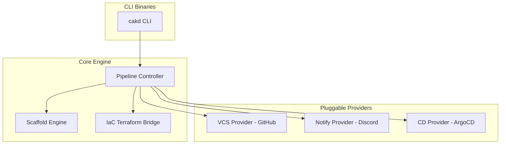

## Overview

CAKD Platform is a CLI that `bootstrap`s cloud-native `project`s from a single `platform.yaml`. It parses the config, renders embedded templates, provisions external resources (GitHub repository via `Terraform Bridge`), pushes generated code, and registers the application with ArgoCD for GitOps deployment.

## Architecture Layers

### Configuration

**Responsibility:** Parse `platform.yaml`, validate structure and logic, and apply defaults.

**Components:** `internal/config` (parse, validate, defaults)

This layer enforces a three-phase pipeline: structure validation, defaults injection, and logic/dependency validation. It produces a hydrated `PlatformConfig` passed to downstream components.

### Orchestration / Pipeline

**Responsibility:** Coordinate the `bootstrap` steps and error handling.

**Components:** `internal/pipeline` (Execute, Run, Step implementations)

The pipeline assembles ordered steps (Scaffold, Infra, VersionControl, Deploy, Notify). Each step implements the `Step` interface, and some may implement `OptionalStep` to allow for conditional execution based on the `platform.yaml` configuration.

### Template Engine

**Responsibility:** Render `project` files from embedded Go templates.

**Components:** `internal/scaffold` (Engine, renderTemplate)

Templates are embedded via `go:embed` and rendered with `[[ ]]` delimiters. Engine generates global and service-specific artifacts (Dockerfile, Helm charts, CI workflows) into the `project` output directory.

### Infrastructure Provisioning (Terraform Bridge)

**Responsibility:** Provision external resources required by the `project`, e.g., GitHub repositories.

**Components:** `internal/iac/terraform` (Bridge)

The `Terraform Bridge` copies embedded modules, writes `terraform.tfvars.json`, runs `terraform init` and `terraform apply`, and parses outputs (e.g., repo URL) for subsequent steps.

### Version Control & GitOps

**Responsibility:** Initialize local git, commit generated files, push to remote, and register with ArgoCD.

**Components:** `internal/provider/version_control/github` (GitHub client), `internal/provider/cd/argocd`

The VCS provider initializes a repo, commits, and pushes via authenticated clone URL. After push, the pipeline registers an ArgoCD application pointing at the repository's manifest.

## Execution Flow

The following describes what happens when a platform is bootstrapped:

### 1. Project Creation Flow (`cakd create`)
- **Pipeline Initialization** — Coordinates steps sequentially using `internal/pipeline`, including parsing `platform.yaml` and preparing the output directory.
- **Step 1: Scaffolding** — Invokes `internal/scaffold` to generate code structures.
- **Step 2: IaC Provisioning** — Runs Terraform via `internal/iac/terraform` to set up remote repositories and credentials.
- **Step 3: VCS Push** — Initializes git repository and pushes code (`internal/provider/version_control/github`).
- **Step 4: CD Registration** — Hooks up manifests into ArgoCD (`internal/provider/cd/argocd`).
- **Step 5: Notification Setup** — Registers webhooks using notification providers (`internal/provider/notify/*`).

## Component Diagram

## Key Design Decisions

-   **Declarative `platform.yaml`**: Centralizes `project` definition and enables repeatable `bootstrap`s.
-   **Modular packages**: Provide clear separation (config, pipeline, scaffold, iac, provider implementations).
-   **Embedded templates (`go:embed`) and `[[ ]]` delimiters**: Avoid conflicts with Helm/CI syntaxes.
-   **`Terraform Bridge`**: Isolates infrastructure provisioning and returns structured outputs used by the pipeline.
-   **Conditional Pipeline Steps**: Steps can implement `OptionalStep` to dynamically skip execution based on configuration, allowing for flexible and configurable `bootstrap` flows without modifying the core pipeline logic.