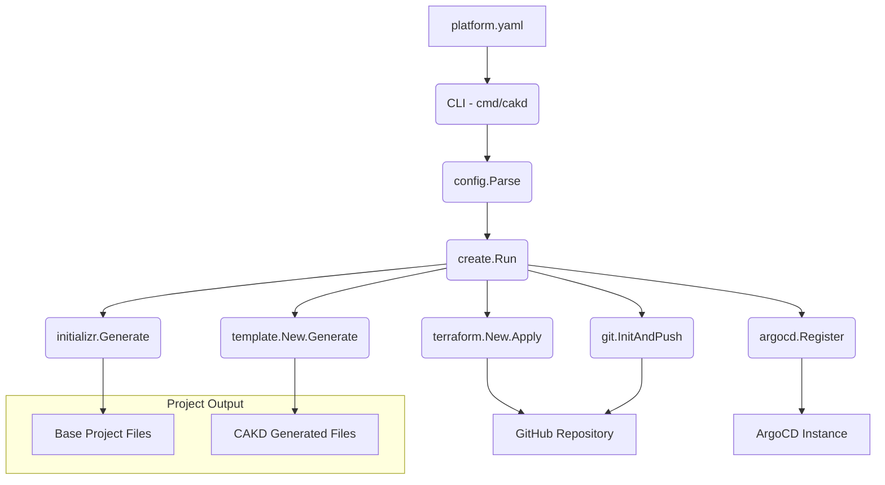

## Overview

CAKD Platform is a CLI tool designed to `bootstrap` new application `project`s with a standardized structure, infrastructure, and GitOps deployment. It solves the problem of inconsistent project setup and manual infrastructure provisioning by automating the generation of code, configuration, and external resources based on a declarative `platform.yaml` definition. The high-level approach involves parsing a configuration file, generating project files, provisioning a GitHub repository, pushing the generated code, and registering the application with ArgoCD.

## Architecture Layers

### Configuration Management

**Responsibility:** Defines, parses, validates, and applies defaults to the `platform.yaml` configuration.

**Components:** `config` package

This layer is responsible for understanding the desired state of a `project` as defined by the user. It reads the `platform.yaml` file, unmarshals it into a structured Go object (`PlatformConfig`), applies any missing default values, and then rigorously validates the configuration against predefined rules to ensure consistency and prevent errors before any generation or provisioning begins.

### Orchestration

**Responsibility:** Coordinates the entire `bootstrap` process by invoking various specialized components.

**Components:** `create` package

This is the central control layer for the `cakd create` command. It manages the overall flow of `project` generation, ensuring that each step—from preparing the output directory to registering with ArgoCD—is executed in the correct sequence. It handles error propagation and provides user feedback throughout the `bootstrap` process.

### Base Project Generation

**Responsibility:** Integrates with external services to generate a foundational project structure.

**Components:** `initializr` package

This layer is responsible for fetching and setting up a basic application structure from an external source, such as Spring Initializr for Java Spring Boot `project`s. It ensures that the `project` starts with a robust, officially supported foundation before CAKD-specific templates are applied.

### Template Rendering

**Responsibility:** Renders Go templates to generate application-specific files like Dockerfiles, Helm charts, and CI/CD configurations.

**Components:** `template` package

The `template engine` in this layer takes the parsed `PlatformConfig` and uses it to populate embedded Go templates. These templates define the standardized files required for deployment, CI/CD, and application configuration, ensuring consistency across all `project`s created by CAKD Platform.

### Infrastructure Provisioning

**Responsibility:** Interacts with Terraform to provision and manage external infrastructure resources, such as GitHub repositories.

**Components:** `terraform` package

This layer, known as the `Terraform Bridge`, is responsible for automating the creation and management of external infrastructure. It embeds Terraform modules, generates `tfvars` from the `PlatformConfig`, executes Terraform commands (`init`, `apply`, `destroy`), and parses outputs to retrieve details about the provisioned resources.

### Version Control Integration

**Responsibility:** Performs Git operations, including repository initialization, committing, and pushing code to a remote repository.

**Components:** `git` package

This layer handles all interactions with Git. After a `project` is generated and a GitHub repository is provisioned, this component initializes a local Git repository, stages and commits the generated files, and pushes them to the remote GitHub repository, handling authentication via a `GITHUB_TOKEN`.

### GitOps Registration

**Responsibility:** Registers the newly created application with an ArgoCD instance for GitOps-driven deployment.

**Components:** `argocd` package

This layer is responsible for the final step of integrating the `project` into a GitOps workflow. It takes the generated ArgoCD application manifest and registers it with an active ArgoCD instance, enabling continuous deployment of the `project` from its GitHub repository.

## Execution Flow

The following describes what happens when `cakd create -f platform.yaml` is run:

1.  **Configuration Parsing** — The `config` package reads the `platform.yaml` file, parses its content, applies default values, and validates the configuration.
2.  **Project Directory Setup** — The `create` package prepares the output directory for the new `project`, handling existing directories if the `--force` flag is used.
3.  **Base Project Generation** — The `initializr` package downloads and sets up a base project (e.g., Spring Boot) into the `project` directory, based on the `platform.yaml` specification.
4.  **CAKD Template Application** — The `template engine` (`template` package) renders embedded Go templates (e.g., Dockerfile, Helm charts, CI/CD workflows, ArgoCD manifests) into the `project` directory, customizing them with values from the `PlatformConfig`.
5.  **GitHub Repository Provisioning** — The `Terraform Bridge` (`terraform` package) copies embedded Terraform modules, generates `terraform.tfvars.json` from the `PlatformConfig`, and executes `terraform init` and `terraform apply` to create a GitHub repository.
6.  **Code Push to GitHub** — The `git` package initializes a Git repository in the `project` directory, commits all generated files, and pushes them to the newly provisioned GitHub repository, using the `GITHUB_TOKEN` for authentication.
7.  **ArgoCD Application Registration** — The `argocd` package registers the application with ArgoCD using the generated `deploy/application.yaml` manifest, enabling GitOps-driven deployment of the `project`.

## Component Diagram

## Key Design Decisions

-   **Declarative Configuration**: The use of `platform.yaml` centralizes the definition of a `project`'s desired state. This allows for consistent, repeatable `bootstrap`s and simplifies automation, as the CLI can interpret and act upon a single source of truth.
-   **Modular Architecture**: The system is broken down into distinct Go packages (`config`, `create`, `initializr`, `template`, `terraform`, `git`, `argocd`), each with a clear responsibility. This separation of concerns enhances maintainability, testability, and allows for easier extension or replacement of individual components.
-   **Leveraging External Tools**: CAKD Platform integrates with specialized external tools like Spring Initializr for base project generation and Terraform for infrastructure provisioning. This avoids reimplementing complex functionality, allowing CAKD to focus on orchestration and integration, while benefiting from the robustness and feature sets of established tools.
-   **GitOps-centric Deployment**: By provisioning a GitHub repository, pushing code, and registering with ArgoCD, CAKD Platform inherently promotes a GitOps workflow. This design decision ensures that `project` deployments are automated, auditable, and driven by version-controlled configurations.
-   **Embedded Templates**: Utilizing Go's `embed` feature for templates simplifies distribution, as all necessary templates are bundled directly within the `cakd` binary. This ensures that the `template engine` always has access to the correct template versions without external dependencies or complex asset management.