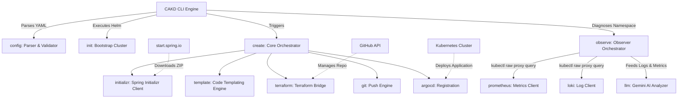
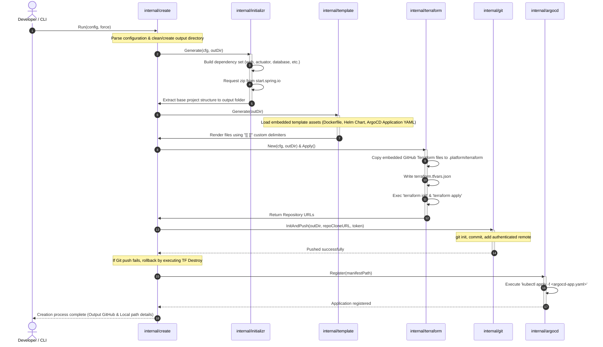
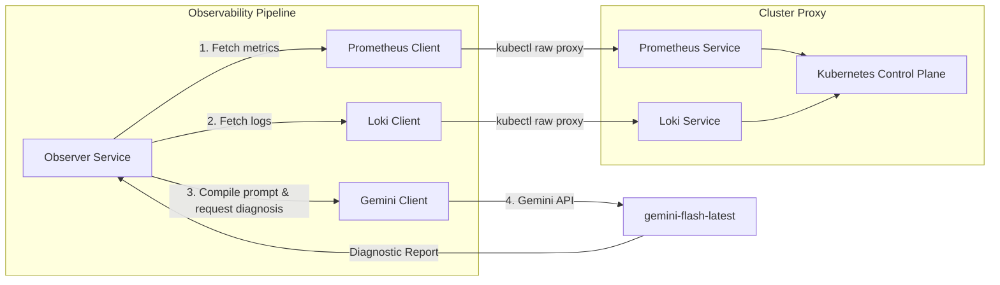

The CAKD Platform is a developer platform and CLI tool designed to streamline the lifecycle of cloud-native applications. It automates bootstrapping local Kubernetes clusters, generating source code (Spring Boot), provisioning Git repositories (via Terraform), and deploying applications (via ArgoCD GitOps). It also includes an AI-driven Kubernetes diagnostic subsystem.

This document describes the design patterns, subsystems, and interaction flows within the project.

---

## High-Level Architecture Overview

The system is constructed as a modular Go-based CLI application. It consists of two major structural pipelines:
1. **The Creation Pipeline** (`create`): Provisioning resource blueprints, repositories, code, and continuous deployment manifests.
2. **The Observability Pipeline** (`observe`): Extracting cluster logs/metrics and synthesizing root-cause diagnoses using Gemini LLM.



---

## Core Lifecycle Flow: Project Creation

The `internal/create` package orchestrates project generation. Below is the sequential process flow executed when a user creates a new project using a configuration file:



---

## Component Deep Dives

### 1. Configuration & Verification Parser (`internal/config`)
- **Responsibility**: Parses incoming declaration files mapped to custom resources (`platform.dev/v1alpha1`, Kind: `Project`).
- **Features**:
  - Implements schema validation for language options, database types, storage patterns, and major Java versions.
  - Dynamically applies baseline default values (e.g., standard database versioning, storage constraints, and monitoring configuration parameters) if fields are missing in user declarations.

### 2. Code Generation Engine (`internal/initializr` & `internal/template`)
- **Spring Initializr client**: Synthesizes query parameters using project characteristics (such as dynamic packaging of dependencies like `data-jpa`, `postgresql`, `prometheus`, etc., based on target deployment metadata) and calls `start.spring.io` to retrieve standard project structures.
- **Boilerplate Rendering**: `internal/template` loads packaged embedded manifests (`embed.FS`) representing baseline artifacts (`Dockerfile`, Helm charts, workflow pipelines, deployment layouts) and translates configurations into static project directories.
- **Custom Delimiters**: Employs unique `[[` and `]]` delimiters to bypass parsing issues with deployment specifications (like standard Helm templates utilizing Go template defaults `{{` and `}}`).

### 3. Cloud Provisioning Engine (`internal/terraform`)
Rather than relying on direct REST interaction, the project leverages a programmatic bridge to standard CLI components.
- **Execution Lifecycle**: 
  1. Spreads and materializes embedded module assets into local working paths (`.platform/terraform`).
  2. Directs state creation via environment files (`terraform.tfvars.json`).
  3. Controls execution flows by monitoring local terminal executions (`terraform init`, `terraform apply`, `terraform destroy`).
  4. Parses pipeline outputs as structural models (`TerraformOutputs`) using JSON translation layers to guide downstream tasks.

### 4. Continuous Deployment Pipeline (`internal/git` & `internal/argocd`)
- **Git Push Engine**: Programmatically initializes a repository, scopes targeted structures to commits, translates access vectors safely into authenticated destination tokens, and pushes configurations to the remote repository.
- **ArgoCD Register**: Translates the declarative output manifest `deploy/application.yaml` (which points to the generated Git repository and target cluster namespace) directly into the Kubernetes control plane using direct local executions via `kubectl apply`.

### 5. Cluster Bootstrapper (`internal/init`)
- Orchestrates environment setup utilizing local configurations.
- Sequentially sets up and executes Helm command flows to install dependencies like:
  - ArgoCD Control Elements (`argocd` namespace).
  - Prometheus Monitoring Stacks (`monitoring` namespace).
  - Grafana Loki Logging Stacks (`monitoring` namespace).

---

## Observability & Diagnostics Subsystem

The diagnostic subsystem gathers cluster analytics and processes them using Generative AI (Google Gemini) to troubleshoot runtime failures:



### Components and Implementation

1. **Observer Service (`internal/observe/observe.go`)**:
   Orchestrates the diagnostic workflow using interface-driven boundaries (`MetricsFetcher`, `LogFetcher`, `AIAnalyzer`).
2. **Prometheus Client (`internal/observe/prometheus.go`)**:
   Queries metrics via Kubernetes API proxies using:
   ```bash
   kubectl get --raw /api/v1/namespaces/monitoring/services/prometheus-k8s:9090/proxy/api/v1/query?query=kube_pod_container_status_restarts_total{namespace="<target>"}
   ```
   This approach extracts restart counts without exposing public metric load-balancers.
3. **Loki Client (`internal/observe/loki.go`)**:
   Fetches runtime application logs by constructing and passing LogQL targets (`{namespace="<target>"}`) via local Kubernetes proxies:
   ```bash
   kubectl get --raw /api/v1/namespaces/monitoring/services/loki:3100/proxy/loki/api/v1/query_range?query={namespace="<target>"}
   ```
4. **Gemini Client (`internal/observe/llm.go`)**:
   Aggregates the retrieved metrics and raw log blocks into a structured system prompt, sending it to the Google Gemini API. It requests a root-cause analysis, actionable fixes, and formats the output in Markdown with Vietnamese explanations.