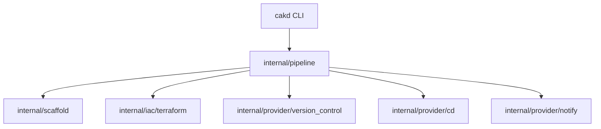

## Overview

CAKD Platform is a CLI that `bootstrap`s cloud-native `project`s from a single `platform.yaml`. It parses the config, renders embedded templates, provisions external resources (GitHub repository via `Terraform Bridge`), pushes generated code, and registers the application with ArgoCD for GitOps deployment.

## Architecture Layers

### Configuration

**Responsibility:** Parse `platform.yaml`, validate structure and logic, and apply defaults.

**Components:** `internal/config` (parse, validate, defaults)

This layer enforces a three-phase pipeline: structure validation, defaults injection, and logic/dependency validation. It produces a hydrated `PlatformConfig` passed to downstream components.

### Orchestration / Pipeline

**Responsibility:** Coordinate the `bootstrap` steps and error handling.

**Components:** `internal/pipeline` (Execute, Run, Step implementations)

The pipeline assembles ordered steps (Scaffold, Infra, Notify, VersionControl, Deploy). Each step implements `Step` and optional `OptionalStep` for conditional execution.

### Template Engine

**Responsibility:** Render `project` files from embedded Go templates.

**Components:** `internal/scaffold` (Engine, renderTemplate)

Templates are embedded via `go:embed` and rendered with `[[ ]]` delimiters. Engine generates global and service-specific artifacts (Dockerfile, Helm charts, CI workflows) into the `project` output directory.

### Infrastructure Provisioning (Terraform Bridge)

**Responsibility:** Provision external resources required by the `project`, e.g., GitHub repositories.

**Components:** `internal/iac/terraform` (Bridge)

The `Terraform Bridge` copies embedded modules, writes `terraform.tfvars.json`, runs `terraform init` and `terraform apply`, and parses outputs (e.g., repo URL) for subsequent steps.

### Version Control & GitOps

**Responsibility:** Initialize local git, commit generated files, push to remote, and register with ArgoCD.

**Components:** `internal/provider/version_control` (GitHub client), `internal/provider/cd/argocd`

The VCS provider initializes a repo, commits, and pushes via authenticated clone URL. After push, the pipeline registers an ArgoCD application pointing at the repository's manifest.

## Execution Flow

### 1. Project Creation Flow (`cakd create`)

1.  Parse and validate `platform.yaml` → produce `PlatformConfig`.
2.  Prepare output directory; honor `--force` to overwrite.
3.  Scaffold base `project` (e.g., Spring Initializr) and render CAKD templates into `out/{project}`.
4.  Run `Terraform Bridge` to create GitHub repository and retrieve outputs.
5.  Initialize git, commit generated files, and push to GitHub (VCS provider).
6.  Register the generated ArgoCD application manifest with ArgoCD.
7.  Set up notifications (e.g., Discord webhooks).
8.  Print summary with repository URL and local path.

## Component Diagram

## Key Design Decisions

-   **Declarative `platform.yaml`**: Centralizes `project` definition and enables repeatable `bootstrap`s.
-   **Modular packages**: Provide clear separation (config, pipeline, scaffold, iac, provider implementations).
-   **Embedded templates (`go:embed`) and `[[ ]]` delimiters**: Avoid conflicts with Helm/CI syntaxes.
-   **`Terraform Bridge`**: Isolates infrastructure provisioning and returns structured outputs used by the pipeline.